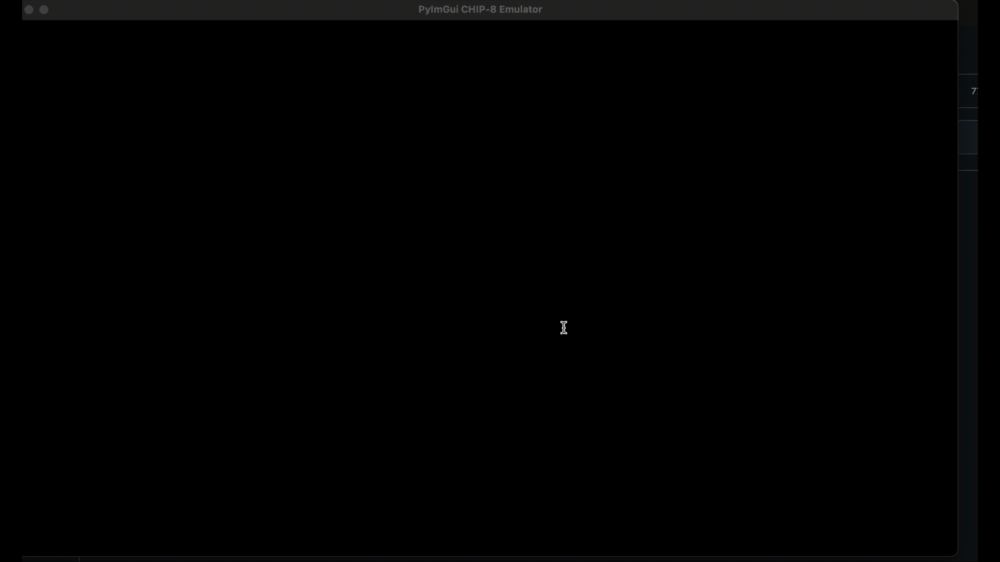

# AI Generated CHIP8 Emulator

This project is a CHIP8 emulator implemented in Python, entirely generated using AI assistance. The emulator demonstrates the capabilities of AI in creating functional software systems.

**Note: No manual code writing was involved in this project.**



## Features

- Full CHIP8 instruction set implementation
- Real-time emulation of CHIP8 programs
- GUI interface using PyImGui for display and input
- Sound support (beep when sound timer is non-zero)
- Customizable color scheme
- Adjustable emulation speed

## Requirements

- Python 3.10+
- PyImGui
- NumPy
- PySDL2

## Installation

1. Ensure you have Python 3.10 or higher installed on your system.

2. Clone this repository:
   ```
   git clone https://github.com/yourusername/ai-generated-chip8-emulator.git
   cd ai-generated-chip8-emulator
   ```

3. Create a virtual environment:
   ```
   python -m venv venv
   ```

4. Activate the virtual environment:
   - On Windows:
     ```
     venv\Scripts\activate
     ```
   - On macOS and Linux:
     ```
     source venv/bin/activate
     ```

5. Install the required dependencies:
   ```
   pip install -r requirements.txt
   ```

## Running the Emulator

After installing the dependencies, you can run the emulator using the following command:

```
python main.py [path_to_rom]
```

Replace `[path_to_rom]` with the path to a CHIP8 ROM file you want to run.

## Controls

- The original CHIP8 keypad is mapped to the following keys on your keyboard:
  ```
  1 2 3 4
  Q W E R
  A S D F
  Z X C V
  ```
- Press 'P' to pause/resume the emulation
- Use the up/down arrow keys to adjust the emulation speed
- Press 'ESC' to exit the emulator

## Customization

You can customize the emulator's appearance by modifying the color variables in the `main.py` file.

## Troubleshooting

If you encounter any issues:
1. Ensure all dependencies are correctly installed
2. Check that you're using a compatible CHIP8 ROM file
3. Verify that your Python version is 3.10 or higher

## Contributing

As this is an AI-generated project for demonstration purposes, contributions are not actively sought. However, feel free to fork the project and experiment with your own modifications!

## License

This project is open-source and available under the MIT License.

## Acknowledgements

This project was created with [Cursor](https://cursor.com) entirely through AI assistance. 

